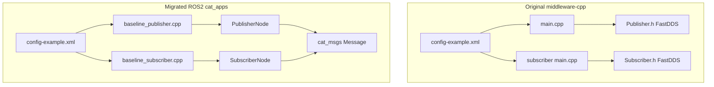
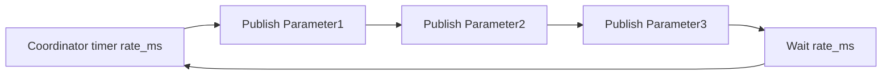
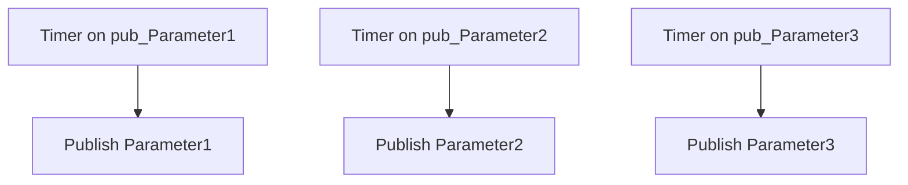
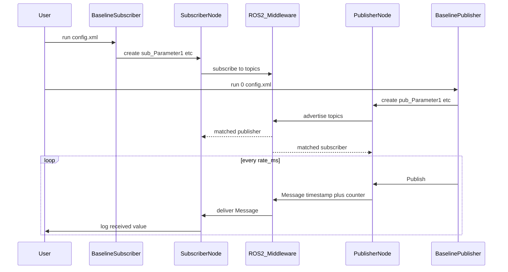
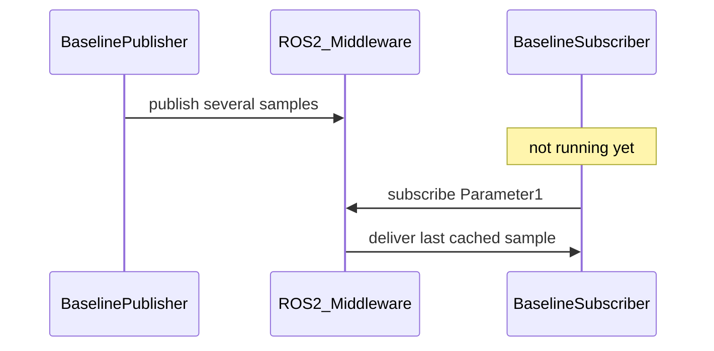
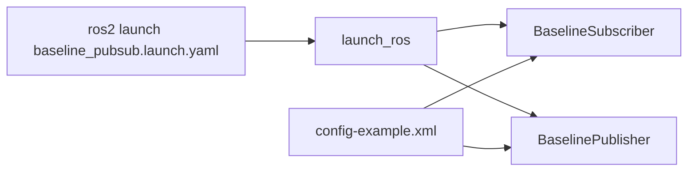

# Baseline Pub/Sub Migration Guide

Complete guide for migrating **middleware-cpp baseline publishers/subscribers** to **ROS2 (`cat_apps`)**.

---

## Table of Contents

1. [Start Here — 60-Second Summary](#1-start-here--60-second-summary)
2. [Glossary](#2-glossary)
3. [What Was the Original System?](#3-what-was-the-original-system)
4. [What Is the New System?](#4-what-is-the-new-system)
5. [Side-by-Side Comparison](#5-side-by-side-comparison)
6. [Architecture Diagrams](#6-architecture-diagrams)
7. [Sequence Diagrams](#7-sequence-diagrams)
8. [Message Format Explained](#8-message-format-explained)
9. [File-by-File Migration Guide](#9-file-by-file-migration-guide)
10. [Change Log — Why Each Change Was Made](#10-change-log--why-each-change-was-made)
11. [New Flow — Step by Step](#11-new-flow--step-by-step)
12. [Real-Time Example Walkthrough](#12-real-time-example-walkthrough)
13. [How to Build](#13-how-to-build)
14. [How to Test (Step-by-Step)](#14-how-to-test-step-by-step)
15. [Launch Files](#15-launch-files)
16. [Verification Checklist](#16-verification-checklist)
17. [References](#17-references)
18. [FAQ](#18-faq)

---

## 1. Start Here — 60-Second Summary

**Before:** Two C++ apps in `middleware-cpp-master` used **Fast DDS directly** to publish/subscribe counter values on topics defined in an **XML config file**.

**After:** Two ROS2 apps in `ros2/ros2/apps/src/porting/cat_apps` do the **same job** using **rclcpp** (ROS2 pub/sub), with the **same XML config format** and **same console output behavior**.

**Why migrate:** Replace the old Fast DDS baseline apps with ROS2-native apps that your team can build, deploy, and introspect with standard ROS2 tools (`ros2 topic list`, `ros2 topic echo`, etc.).

**Important:** The migrated apps talk to each other over **ROS2**. They do **not** communicate with the old Fast DDS baseline binaries on the wire.

---

## 2. Glossary

| Term | Simple meaning |
|------|----------------|
| **Publisher** | Sends data on a topic |
| **Subscriber** | Receives data from a topic |
| **Topic** | Named channel (e.g. `Parameter1`) |
| **Message** | Data packet sent on a topic |
| **QoS** | Quality of Service — rules for delivery (reliable? remember last message?) |
| **Fast DDS** | Middleware library used directly in the original apps |
| **ROS2 / rclcpp** | Robot Operating System 2 — the new middleware layer |
| **Executor** | ROS2 loop that processes timers and incoming messages |
| **XML config** | File listing which topics to publish/subscribe and counter ranges |
| **Transient Local** | Publisher keeps the last message so late subscribers can receive it |
| **Domain Participant** | Fast DDS object that joins the network (original only) |
| **Node** | ROS2 process unit (each publisher/subscriber instance) |

---

## 3. What Was the Original System?

### Location

```
middleware-cpp-master/middleware-cpp-master/apps/
├── baseline-publishers/
│   ├── main.cpp          ← reads XML, runs publish loop
│   ├── Publisher.h       ← Fast DDS publisher per topic
│   └── config-example.xml
└── baseline-subscribers/
    ├── main.cpp          ← reads XML, blocks forever
    ├── Subscriber.h      ← Fast DDS subscriber per topic
    └── config-example.xml
```

### Config file (single XML)

```xml
<configuration>
    <publishers rate_ms="100">
        <parameter name="Parameter1" min="0" max="10" />
        <parameter name="Parameter2" min="20" max="30" />
        <parameter name="Parameter3" min="40" max="50" />
    </publishers>
    <subscribers>
        <parameter name="Parameter1" />
        <parameter name="Parameter2" />
        <parameter name="Parameter3" />
    </subscribers>
</configuration>
```

| XML piece | Meaning |
|-----------|---------|
| `rate_ms="100"` | Publish every 100 ms |
| `name="Parameter1"` | **Topic name** (and parameter id) |
| `min` / `max` | Counter range that wraps |

### How to run (original)

```bash
./BaselineSubscribersApp config-example.xml
./BaselinePublishersApp 0 config-example.xml   # 0 = one thread, 1 = multi-thread
```

### What each publish sends

Every message contains:

1. **`additional_information`** — UTC timestamp string, e.g. `2026-06-16 14:30:01`
2. **`protobuf`** — 4 bytes encoding a counter (big-endian uint32), e.g. value `5` → `[0, 0, 0, 5]`

Counter increments from `min` to `max`, then wraps back to `min`.

---

## 4. What Is the New System?

### Location

```
ros2/ros2/apps/src/porting/
├── cat_msgs/msg/Message.msg     ← ROS2 message type (same fields as original IDL)
└── cat_apps/
    ├── src/baseline_publisher.cpp
    ├── src/baseline_subscriber.cpp
    ├── src/publisher_node.cpp
    ├── src/subscriber_node.cpp
    ├── src/publisher_coordinator.cpp
    ├── include/cat_apps/message_codec.hpp
    ├── launch/baseline_pubsub.launch.yaml
    ├── launch/baseline_subscriber.launch.yaml
    ├── launch/baseline_publisher.launch.yaml
    └── src/config-example.xml   ← same format as original
```

### Executables

| Old app | New app |
|---------|---------|
| `BaselinePublishersApp` | `BaselinePublisher` |
| `BaselineSubscribersApp` | `BaselineSubscriber` |

### How to run (migrated)

**Option A — Launch file (recommended):**

```bash
source install/setup.bash
ros2 launch cat_apps baseline_pubsub.launch.yaml
```

**Option B — Manual executables:**

```bash
source install/setup.bash
ros2 run cat_apps BaselineSubscriber $(ros2 pkg prefix cat_apps)/share/cat_apps/config-example.xml
ros2 run cat_apps BaselinePublisher 0 $(ros2 pkg prefix cat_apps)/share/cat_apps/config-example.xml
```

---

## 5. Side-by-Side Comparison

| Original | Migrated | Status |
|----------|----------|--------|
| `Publisher.h` | `publisher_node.cpp` + `message_codec.hpp` | Reimplemented |
| `Subscriber.h` | `subscriber_node.cpp` + `message_codec.hpp` | Reimplemented |
| `baseline-publishers/main.cpp` | `baseline_publisher.cpp` + `publisher_coordinator.cpp` | Reimplemented |
| `baseline-subscribers/main.cpp` | `baseline_subscriber.cpp` | Reimplemented |
| `cat::middleware::Message` (IDL) | `cat_msgs/msg/Message.msg` | Equivalent |
| Fast DDS DataWriter/DataReader | rclcpp Publisher/Subscription | Replaced |
| `load_parameters.yaml` (draft port) | **Removed** — min/max in XML | Removed |
| XML extended schema (draft port) | **Reverted** to original schema | Fixed |
| Two manual terminal commands | `ros2 launch cat_apps baseline_pubsub.launch.yaml` | Added |

---

## 6. Architecture Diagrams

### High-level: old vs new



### Thread mode 0 (single loop)



### Thread mode 1 (multi-thread)



Each publisher node has its own timer and runs on the multi-threaded executor.

---

## 7. Sequence Diagrams

### Startup and first message



### Late subscriber (Transient Local)



Because QoS is **Transient Local**, a subscriber that starts late still receives the publisher's most recent message.

---

## 8. Message Format Explained

### ROS2 message definition

File: `cat_msgs/msg/Message.msg`

```
string additional_information
uint8[] protobuf
```

Same two fields as the original IDL struct `cat::middleware::Message`.

### Counter encoding example

| Counter value | `protobuf` bytes (hex) |
|---------------|--------------------------|
| 0 | `00 00 00 00` |
| 1 | `00 00 00 01` |
| 10 | `00 00 00 0A` |
| 255 | `00 00 00 FF` |

Implemented in `message_codec.hpp`:

- **Publish:** `ToUint32Bytes(counter)`
- **Subscribe:** `FromUint32Bytes(message.protobuf)`

### Timestamp

Format: `YYYY-MM-DD HH:MM:SS` in UTC (`GetSystemTime()`).

---

## 9. File-by-File Migration Guide

### `message_codec.hpp` (NEW)

- **What:** Shared helpers for timestamp and byte encoding.
- **Why:** Original had `To()`, `From()`, `GetSystemTime()` inside Publisher/Subscriber classes; extracted to avoid duplication.
- **How:** Ported logic verbatim from `Publisher.h` and `Subscriber.h`.
- **Original reference:** `middleware-cpp-master/apps/baseline-publishers/Publisher.h`

---

### `publisher_node.cpp`

- **What:** ROS2 node that publishes one topic with a wrapping counter.
- **Why:** Replaces Fast DDS `Publisher` class.
- **How:**
  - QoS: Reliable + Transient Local + depth 1
  - `Publish()` builds message, publishes, increments counter
  - `matched_callback` logs connect/disconnect
  - `StartTimer()` used only in thread mode 1
- **Before (broken draft):**

```cpp
msg.additional_information = "Hello world!";
if (count_subscribers() > 0) { publish(); }
```

- **After:**

```cpp
data.additional_information = GetSystemTime();
data.protobuf = ToUint32Bytes(m_current_value);
m_publisher->publish(data);
// increment/wrap counter
```

---

### `subscriber_node.cpp`

- **What:** ROS2 node that subscribes to one topic immediately.
- **Why:** Replaces Fast DDS `Subscriber` class.
- **How:** Subscribe in constructor; decode counter; log same format as original.
- **Before (broken draft):** Polled `count_publishers()` for 100 ms before subscribing; QoS depth 10.
- **After:** Immediate subscription; matching QoS; full counter decode.

---

### `publisher_coordinator.cpp` (NEW)

- **What:** Helper node with one timer for thread mode 0.
- **Why:** Original `RunNoThreads()` publishes all topics, then sleeps once — not one timer per topic.
- **How:** Single wall timer calls `Publish()` on each `PublisherNode` in sequence.

---

### `baseline_publisher.cpp`

- **What:** Main entry — parses XML, creates nodes, runs executor.
- **Why:** Replaces `baseline-publishers/main.cpp`.
- **How:**
  - Parses original XML schema (`rate_ms`, `parameter name/min/max`)
  - Mode 0: coordinator + single-threaded executor
  - Mode 1: per-node timers + multi-threaded executor
- **Removed:** `--params-file load_parameters.yaml` (unused YAML approach).

---

### `baseline_subscriber.cpp`

- **What:** Main entry — parses XML, creates subscriber nodes, spins executor.
- **Why:** Replaces `baseline-subscribers/main.cpp`.
- **How:**
  - CLI: `./BaselineSubscriber config.xml` (one argument, like original)
  - Parses `/configuration/subscribers` (fixed bug that read `/configuration/publishers`)

---

### `config-example.xml`

- **What:** Configuration for both apps.
- **Why:** Drop-in compatibility with middleware-cpp config.
- **How:** Reverted from extended `<node topic=...>` schema back to original `<parameter name min max>` schema.

---

### `launch/baseline_*.launch.yaml` (NEW)

- **What:** ROS2 launch files to start baseline subscriber and/or publisher.
- **Why:** One-command bringup instead of two terminals.
- **How:** Pass `config_file` and `thread_mode` launch args to existing executables; installed via CMake to `share/cat_apps/launch/`.

---

### `CMakeLists.txt`

- **What:** Build rules for both executables.
- **Why:** Remove broken deps; install config to standard ROS2 share path.
- **How:** Dropped `rcl_yaml_param_parser`; added `publisher_coordinator.cpp`; install to `share/cat_apps/`.

---

## 10. Change Log — Why Each Change Was Made

| # | Change | Why | What | How |
|---|--------|-----|------|-----|
| 1 | Revert XML schema | Original uses `parameter name/min/max` | Config matches middleware-cpp | Updated `config-example.xml` |
| 2 | Remove `load_parameters.yaml` | Unused + not in original; min/max belong in XML | Single config file | Deleted file, removed `--params-file` |
| 3 | Fix subscriber XML path | Bug: read publishers section | Subscribers created from correct config | `select_node("/configuration/subscribers")` |
| 4 | Fix subscriber CLI | Original takes 1 arg | Same usage as original | `argc == 2` |
| 5 | Port counter + timestamp | Core baseline behavior | Same payload as Fast DDS version | `message_codec.hpp` + `Publish()` |
| 6 | Remove `count_subscribers` gate | Original always publishes | Same timing behavior | Publish every timer tick |
| 7 | Immediate subscribe | Original creates DataReader at startup | No polling delay | Subscribe in constructor |
| 8 | Matching QoS both sides | Original uses Reliable + Transient Local | Compatible delivery | `QoS(1).reliable().transient_local()` |
| 9 | Coordinator for mode 0 | Original publishes all then sleeps once | Same thread semantics | `PublisherCoordinator` |
| 10 | Matched callbacks | Original logs connect/disconnect | Same operator visibility | `event_callbacks.matched_callback` |
| 11 | Fix CMake deps | Broken link to yaml parser | Clean build | Removed unused libraries |
| 12 | process_launcher `args` attribute | Launcher only passed binary path | Baseline apps get config + mode args | `execv` with parsed `args` XML attribute |
| 13 | ROS2 launch files | Manual two-terminal startup | One-command bringup | `launch/baseline_*.launch.yaml` |

---

## 11. New Flow — Step by Step

### Publisher startup

1. User runs `BaselinePublisher 0 config.xml`
2. `rclcpp::init()` starts ROS2
3. XML loaded; `rate_ms=100`, three parameters parsed
4. Three `PublisherNode` instances created (`pub_Parameter1`, etc.)
5. Mode 0: `PublisherCoordinator` timer created
6. Executor spins
7. Every 100 ms: publish Parameter1, Parameter2, Parameter3 in order
8. Each publish: timestamp + counter bytes sent on topic

### Subscriber startup

1. User runs `BaselineSubscriber config.xml`
2. Three `SubscriberNode` instances created (`sub_Parameter1`, etc.)
3. Each subscribes immediately to its topic
4. Executor spins
5. On message: decode counter, print log line

---

## 12. Real-Time Example Walkthrough

**Config:** `rate_ms=100`, Parameter1 min=0 max=10.

### Timeline

| Time | Publisher action | Subscriber log (Parameter1) |
|------|-------------------|------------------------------|
| T=0 | Apps start, match | `[Parameter1] Subscriber created.` |
| T=0 | Match | `[Parameter1] Connected to publisher.` |
| T=100ms | Publish counter=0 | `[2026-06-16 10:00:00] received [Parameter1]=[0]` |
| T=200ms | Publish counter=1 | `[2026-06-16 10:00:00] received [Parameter1]=[1]` |
| T=300ms | Publish counter=2 | `[2026-06-16 10:00:00] received [Parameter1]=[2]` |
| ... | ... | ... |
| T=1200ms | Publish counter=10 | `... received [Parameter1]=[10]` |
| T=1300ms | Wrap to 0 | `... received [Parameter1]=[0]` |

Parameter2 counts 20→30→20. Parameter3 counts 40→50→40.

---

## 13. How to Build

See also [apps/Readme.md](../apps/Readme.md) for Docker setup.

### Option A — Automated (recommended)

```bash
# 1. Start container (from ros2/docker on host)
./launch-guest-os.sh

# 2. Build + smoke test inside container
docker exec -it GuestOS-Base-${USER} bash /app/ros2_ws/scripts/build-and-test-baseline.sh
```

Build only (skip smoke test):

```bash
docker exec -it GuestOS-Base-${USER} bash -c 'RUN_SMOKE_TEST=0 /app/ros2_ws/scripts/build-and-test-baseline.sh'
```

### Option B — Manual

```bash
# Inside GuestOS-Base docker container
cd /app/ros2_ws
source /opt/ros/jazzy/setup.bash
colcon build --packages-select cat_msgs pugixml cat_apps process_launcher
source install/setup.bash
```

---

## 14. How to Test (Step-by-Step)

### Step 0 — Automated smoke test

Run the script from Section 13 Option A. **Expected final lines:**

```
=== PASS: subscriber received Parameter1 data ===
=== PASS: publisher started ===
=== PASS: launch file delivered Parameter1 data ===
=== All checks passed ===
```

### Step 1 — Build

```bash
colcon build --packages-select cat_msgs pugixml cat_apps process_launcher
source install/setup.bash
```

**Expected:** Build completes with no errors.

---

### Step 2 — Full pub/sub test (launch file, recommended)

Single terminal:

```bash
ros2 launch cat_apps baseline_pubsub.launch.yaml
```

**Expected:** Subscriber and publisher logs interleaved on one screen — same messages as the manual two-terminal test below.

Thread mode 1:

```bash
ros2 launch cat_apps baseline_pubsub.launch.yaml thread_mode:=1
```

---

### Step 2b — Full pub/sub test (manual, two terminals)

**Terminal 1 — Subscriber:**

```bash
ros2 run cat_apps BaselineSubscriber \
  $(ros2 pkg prefix cat_apps)/share/cat_apps/config-example.xml
```

**Expected output:**

```
Generating subscribers...
[Parameter1] Subscriber created.
[Parameter2] Subscriber created.
[Parameter3] Subscriber created.
Subscribers generated were [3]
```

**Terminal 2 — Publisher:**

```bash
ros2 run cat_apps BaselinePublisher 0 \
  $(ros2 pkg prefix cat_apps)/share/cat_apps/config-example.xml
```

**Expected output:**

```
Generating publishers...
[Parameter1] Publisher created.
...
Publishers generated were [3] with a rate of [100] milliseconds.
Running all in main thread.
[Parameter1] Connected to subscriber.
...
```

Both terminals show `received [ParameterX]=[N]` lines every 100 ms.

---

### Step 3 — Thread mode 1

Same as Step 2 but publisher command uses `1` instead of `0`:

```bash
ros2 run cat_apps BaselinePublisher 1 \
  $(ros2 pkg prefix cat_apps)/share/cat_apps/config-example.xml
```

**Expected:** `Running with separate threads.` — counters still wrap correctly.

---

### Step 4 — ROS2 introspection

```bash
ros2 topic list
ros2 topic echo /Parameter1 --once
ros2 topic hz /Parameter1
```

---

### Step 5 — Late subscriber (Transient Local)

1. Start publisher only; wait 5 seconds
2. Start subscriber
3. Subscriber should receive at least the latest sample soon after connecting

---

### Step 6 — Original config compatibility

Copy `middleware-cpp-master/.../config-example.xml` to any path and run both apps with that file. Behavior should match.

---

### Step 7 — process_launcher

The launcher reads `config-example.xml` from its working directory and supports an `args` attribute per app:

```xml
<app name="/app/ros2_ws/install/cat_apps/lib/cat_apps/BaselineSubscriber"
     args="/app/ros2_ws/install/cat_apps/share/cat_apps/config-example.xml"
     policy="0"/>
<app name="/app/ros2_ws/install/cat_apps/lib/cat_apps/BaselinePublisher"
     args="0 /app/ros2_ws/install/cat_apps/share/cat_apps/config-example.xml"
     policy="0"/>
```

Run after build:

```bash
source /app/ros2_ws/install/setup.bash
/app/ros2_ws/install/process_launcher/lib/process_launcher/launcher \
  $(ros2 pkg prefix process_launcher)/share/process_launcher/config-example.xml
```

---

### Troubleshooting

| Symptom | Likely cause | Fix |
|---------|--------------|-----|
| No messages received | Publisher not running | Start publisher or use `ros2 launch cat_apps baseline_pubsub.launch.yaml` |
| Build fails / stale artifacts | Old CMake cache | Clean build: `rm -rf build/cat_msgs install/cat_msgs` (or run smoke script which cleans by default) |
| `cat_msgs` symlink / `Is a directory` | Stale build + `--symlink-install` on Docker/Windows mount | `rm -rf build/cat_msgs install/cat_msgs`; use `bash scripts/build-and-test-baseline.sh` (no symlink-install) |
| Config parse error | Wrong XML schema | Use original `<parameter name min max>` format |
| `ros2 run` not found | Workspace not sourced | `source install/setup.bash` |
| `AMENT_*: unbound variable` when running smoke script | `set -u` conflicts with ROS setup.bash | Use `bash scripts/build-and-test-baseline.sh` (script uses `set -eo pipefail` without `-u`) |
| No match logs | Normal at startup — wait briefly | DDS discovery takes ~1 s |

---

## 15. Launch Files

Launch files start baseline apps with **`ros2 launch`** instead of separate `ros2 run` commands. They pass the same CLI arguments the executables already expect.

### Files

| Launch file | Starts |
|-------------|--------|
| `baseline_pubsub.launch.yaml` | Subscriber + publisher |
| `baseline_subscriber.launch.yaml` | Subscriber only |
| `baseline_publisher.launch.yaml` | Publisher only |

Installed to: `share/cat_apps/launch/` after `colcon build`.

### Launch arguments

| Argument | Default | Purpose |
|----------|---------|---------|
| `config_file` | `$(find-pkg-share cat_apps)/config-example.xml` | XML config path |
| `thread_mode` | `0` | Publisher thread mode (`0` or `1`) |

### Examples

```bash
source install/setup.bash

# Full stack (default config, thread mode 0)
ros2 launch cat_apps baseline_pubsub.launch.yaml

# Multi-threaded publisher
ros2 launch cat_apps baseline_pubsub.launch.yaml thread_mode:=1

# Custom config
ros2 launch cat_apps baseline_pubsub.launch.yaml config_file:=/path/to/config.xml

# Individual nodes
ros2 launch cat_apps baseline_subscriber.launch.yaml
ros2 launch cat_apps baseline_publisher.launch.yaml thread_mode:=0
```

### Why add launch files?

- **What:** ROS2-standard way to bring up multiple nodes with one command.
- **Why:** Easier demos, testing, and deployment — no need for two terminals.
- **How:** YAML passes `config_file` and `thread_mode` to existing executables; no C++ changes.



---

## 16. Verification Checklist

- [ ] Build succeeds
- [ ] `ros2 launch cat_apps baseline_pubsub.launch.yaml` works
- [ ] Subscriber CLI: one argument (config path only)
- [ ] Publisher CLI: two arguments (mode + config)
- [ ] Three publishers and three subscribers created
- [ ] Match connect/disconnect logs appear
- [ ] Parameter1: 0→10→0...
- [ ] Parameter2: 20→30→20...
- [ ] Parameter3: 40→50→40...
- [ ] Timestamp in received logs is valid UTC
- [ ] Thread mode 0 and 1 both work
- [ ] Late subscriber receives last sample
- [ ] middleware-cpp config file works unchanged

---

## 17. References

- [ROS2 QoS concepts (Jazzy)](https://docs.ros.org/en/jazzy/Concepts/Intermediate/About-Quality-of-Service-Settings.html)
- [Writing a simple C++ publisher/subscriber](https://docs.ros.org/en/jazzy/Tutorials/Beginner-Client-Libraries/Writing-A-Simple-Cpp-Publisher-And-Subscriber.html)
- Local QoS notes: [quality-of-services.md](../apps/quality-of-services.md)
- Original publisher: `middleware-cpp-master/apps/baseline-publishers/Publisher.h`
- Original subscriber: `middleware-cpp-master/apps/baseline-subscribers/Subscriber.h`

---

## 18. FAQ

**Can ROS2 apps talk to the old Fast DDS baseline apps?**

No. This migration **replaces** the old apps. Both sides must use the new ROS2 executables.

**Why XML and not YAML?**

The original system uses XML. Keeping the same format means existing config files work without changes.

**Why was `load_parameters.yaml` removed?**

It was part of an incomplete draft port. Min/max were in YAML but never read by the code. Everything is in XML now, matching the original.

**What is `pub_Parameter1` vs `Parameter1`?**

`Parameter1` is the **topic name** (same as original). `pub_Parameter1` is the internal **ROS node name** — required by ROS2 but not visible in message content.

**Do I need a subscriber connected for the publisher to send?**

No. The publisher sends on every timer tick, same as the original.

**What does thread mode 0 vs 1 mean?**

- **0:** One loop publishes all topics, then waits (like original `RunNoThreads`)
- **1:** Each topic has its own timer thread (like original `RunWithThreads`)

**When should I use launch files vs `ros2 run`?**

Use **`ros2 launch cat_apps baseline_pubsub.launch.yaml`** for normal bringup (one command). Use **`ros2 run`** when debugging a single executable in isolation or when integrating with `process_launcher`.
